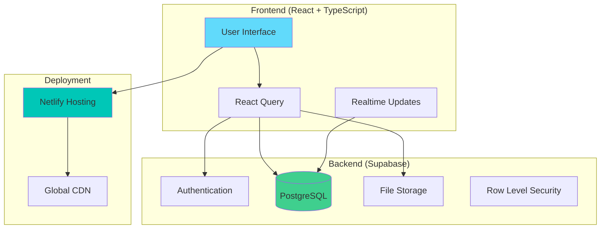

# 🎓 LIT — Student Profile Platform

<div align="center">

[](https://app.netlify.com/projects/lit-pro/deploys)


**A pixel-perfect student profile platform with admin-controlled content, real-time updates, media uploads, and production deployment.**

[🚀 Live Demo](#-live-demo) • [⚡ Quick Start](#-quick-start) • [📖 Documentation](#-documentation) • [🤝 Contributing](#-contributing)

</div>

---

## 🌟 Overview

LIT (Learning, Innovation, Technology) is a modern student profile platform built with React and Supabase. It provides a comprehensive solution for showcasing student achievements, skills, and experiences with a powerful admin interface for content management.

### ✨ Key Features

<table>
<tr>
<td>

**🔐 Secure Admin System**
- Magic link authentication
- Role-based access control
- Real-time content updates

</td>
<td>

**📱 Modern UI/UX**
- Responsive design
- Tailwind CSS + shadcn/ui
- Accessible components

</td>
</tr>
<tr>
<td>

**☁️ Cloud-Powered**
- Supabase backend
- Netlify deployment
- Media storage & CDN

</td>
<td>

**⚡ Performance**
- React Query caching
- Optimistic updates
- Real-time synchronization

</td>
</tr>
</table>

---

## 🏗️ Architecture



---

## 🚀 Live Demo

> 🎯 **Try it yourself!** Experience the full functionality with these demo routes:

| Feature | URL | Description |
|---------|-----|-------------|
| 📋 **Student Profiles** | `/profiles` | Browse all student profiles |
| 👤 **Individual Profile** | `/profile/:slug` | Detailed student showcase |
| ⚙️ **Admin Dashboard** | `/admin` | Content management system |

**Demo Site:** `https://68ad7ec9096cd942541ce652--lit-pro.netlify.app/`

---

## ⚡ Quick Start

### Prerequisites

- **Node.js** 18+ (tested with Node 22)
- **npm** or **yarn**
- **Supabase** account

### 1️⃣ Clone & Install

```bash
# Clone the repository
git clone https://github.com/anshj2002/lit-student-profile.git
cd lit-student-profile/lit-profile

# Install dependencies
npm install
```

### 2️⃣ Environment Setup

```bash
# Copy environment template
cp .env.example .env
```

Update `.env` with your Supabase credentials:

```env
VITE_SUPABASE_URL=https://your-project.supabase.co
VITE_SUPABASE_ANON_KEY=your-anon-key-here
```

### 3️⃣ Database Setup

1. Create a new project at [supabase.com](https://supabase.com)
2. Run the following SQL in your Supabase SQL editor:

<details>
<summary>📊 <strong>Click to expand database schema</strong></summary>

```sql
-- Enable UUID extension
create extension if not exists "uuid-ossp";

-- Students table
create table if not exists public.students(
  id uuid primary key default uuid_generate_v4(),
  full_name text not null,
  institution text,
  bio text,
  avatar_url text,
  slug text unique,
  sort_order int default 0,
  created_at timestamptz default now(),
  updated_at timestamptz default now()
);

-- Skills table
create table if not exists public.skills(
  id uuid primary key default uuid_generate_v4(),
  student_id uuid not null references public.students(id) on delete cascade,
  name text not null,
  level int check (level between 0 and 100) default 0,
  endorsements_count int default 0,
  category text,
  sort_order int default 0,
  created_at timestamptz default now()
);

-- Enable RLS
alter table public.students enable row level security;
alter table public.skills enable row level security;

-- Public read policies
create policy "public_read_students" on public.students for select using (true);
create policy "public_read_skills" on public.skills for select using (true);

-- Admin users table
create table if not exists public.admin_users(
  user_id uuid primary key references auth.users(id) on delete cascade,
  email text unique not null,
  created_at timestamptz default now()
);

-- Admin helper function
create or replace function public.is_admin()
returns boolean language sql stable as $$
  select exists (select 1 from public.admin_users where user_id = auth.uid());
$$;

-- Admin management policies
create policy "admins_manage_students" on public.students
  for all using (public.is_admin()) with check (public.is_admin());

create policy "admins_manage_skills" on public.skills
  for all using (public.is_admin()) with check (public.is_admin());
```

</details>

### 4️⃣ Storage Configuration

<details>
<summary>📁 <strong>Click to expand storage setup</strong></summary>

Create a storage bucket and policies:

```sql
-- Create bucket (via Supabase Dashboard: Storage > Create Bucket)
-- Name: 'profile-media'
-- Public: true

-- Storage policies
create policy "public_read_media"
  on storage.objects for select 
  using (bucket_id = 'profile-media');

create policy "admin_write_media"
  on storage.objects for all 
  using (public.is_admin()) 
  with check (public.is_admin());
```

</details>

### 5️⃣ Run Development Server

```bash
npm run dev
```

Open [http://localhost:5173](http://localhost:5173) in your browser! 🎉

---

## 🔧 Project Structure

```
lit-profile/
├── 📁 src/
│   ├── 📁 components/         # Reusable UI components
│   ├── 📁 hooks/             # Custom React hooks
│   ├── 📁 lib/               # Utilities & configurations
│   ├── 📁 pages/             # Route components
│   ├── 📁 sections/          # Profile sections
│   └── 📁 styles/            # Global styles
├── 📁 public/
│   └── _redirects           # Netlify SPA routing
├── 📄 index.html
├── 📄 package.json
└── 📄 vite.config.ts
```

---

## 🎯 Core Features

### 🏠 Public Interface
- **Student Directory**: Browse all profiles with search and filtering
- **Profile Pages**: Comprehensive student showcases with:
  - Personal information and bio
  - Skills with proficiency levels
  - Experience timeline
  - Endorsements and testimonials
  - Competition achievements
  - Multimedia feedback (text, audio, video)

### ⚙️ Admin Dashboard
- **Secure Authentication**: Magic link email authentication
- **Live Preview**: Real-time preview while editing
- **Media Management**: Upload and manage student photos and media
- **Content Management**: Full CRUD operations on all profile sections

### 🔒 Security Features
- **Row Level Security (RLS)**: Database-level access control
- **Admin Role Management**: Granular permission system
- **Secure File Upload**: Protected media storage

---

## 🚀 Deployment

### Netlify Deployment (Recommended)

1. **Fork this repository**

2. **Connect to Netlify:**
   - Go to [netlify.com](https://netlify.com)
   - Click "New site from Git"
   - Select your forked repository

3. **Build Configuration:**
   ```
   Base directory: lit-profile
   Build command: npm run build
   Publish directory: dist
   ```

4. **Environment Variables:**
   ```
   VITE_SUPABASE_URL=your-supabase-url
   VITE_SUPABASE_ANON_KEY=your-anon-key
   ```

5. **SPA Routing:**
   - Ensure `lit-profile/public/_redirects` contains:
   ```
   /*  /index.html  200
   ```

### Authentication Setup

Configure your Supabase Auth URLs:
- **Site URL**: `https://68ad7ec9096cd942541ce652--lit-pro.netlify.app/`
- **Redirect URLs**: `https://68ad7ec9096cd942541ce652--lit-pro.netlify.app/admin`

---

## 👩‍💼 Admin Access Setup

1. **Deploy your application**

2. **Visit `/admin` and sign in** with your email

3. **Add yourself as admin** in Supabase SQL editor:
   ```sql
   insert into public.admin_users (user_id, email)
   select id, email from auth.users 
   where email = 'your-email@domain.com'
   on conflict (user_id) do nothing;
   ```

4. **Sign out and back in** to refresh permissions

You now have full admin access! 🎉

---

## 📸 Screenshots

<div align="center">

### Public Profile View


### Admin Dashboard


</div>

---

## 🧪 Development Scripts

```bash
# Development
npm run dev          # Start development server
npm run build        # Production build
npm run preview      # Preview production build
npm run lint         # Run ESLint
npm run type-check   # TypeScript checking
```

---

## 🔍 Troubleshooting

<details>
<summary><strong>🚨 Common Issues & Solutions</strong></summary>

### Build Fails on Netlify
**Problem:** `Missing script: build`  
**Solution:** Set base directory to `lit-profile` or use root-level proxy scripts

### 404 on Deep Links
**Problem:** Direct URLs return 404  
**Solution:** Ensure `_redirects` file exists with SPA redirect rule

### Admin Access Denied (403)
**Problem:** Cannot save changes in admin  
**Solution:** 
1. Check if email is in `admin_users` table
2. Sign out and back in to refresh session
3. Verify RLS policies are correct

### Avatar Upload Fails
**Problem:** File upload returns error  
**Solution:** Check storage bucket policies and ensure `profile-media` bucket exists

### Styles Not Loading
**Problem:** Tailwind styles not applying  
**Solution:** 
1. Verify `globals.css` is imported in `main.tsx`
2. Check Tailwind config `content` paths
3. Restart development server

</details>

---

## 🎯 5-Minute Demo Checklist

- [ ] Browse `/profiles` student directory
- [ ] View individual profile at `/profile/:slug`
- [ ] Sign in to admin at `/admin`
- [ ] Upload student avatar
- [ ] Add/edit skills with live preview
- [ ] Create experience entry
- [ ] Test real-time updates
- [ ] Verify public profile reflects changes

---

## 🛠️ Tech Stack

<div align="center">

| Category | Technologies |
|----------|-------------|
| **Frontend** | React 19, TypeScript, Vite |
| **Styling** | Tailwind CSS, shadcn/ui |
| **Backend** | Supabase (Auth, Database, Storage) |
| **State Management** | React Query (TanStack Query) |
| **Deployment** | Netlify |
| **Database** | PostgreSQL with RLS |

</div>

---

## 🤝 Contributing

We welcome contributions! Please see our [Contributing Guide](CONTRIBUTING.md) for details.

1. Fork the repository
2. Create your feature branch (`git checkout -b feature/amazing-feature`)
3. Commit your changes (`git commit -m 'Add some amazing feature'`)
4. Push to the branch (`git push origin feature/amazing-feature`)
5. Open a Pull Request

---

## 📄 License

This project is licensed under the MIT License - see the [LICENSE](LICENSE) file for details.

---

## 🙏 Acknowledgments

- [Supabase](https://supabase.com) for the amazing backend platform
- [shadcn/ui](https://ui.shadcn.com) for the beautiful component library
- [Tailwind CSS](https://tailwindcss.com) for the utility-first CSS framework
- [Netlify](https://netlify.com) for seamless deployment

---

<div align="center">

**Made with ❤️ by the LIT Team**

[⭐ Star this repo](../../stargazers) • [🐛 Report Bug](../../issues) • [💡 Request Feature](../../issues)

</div>
